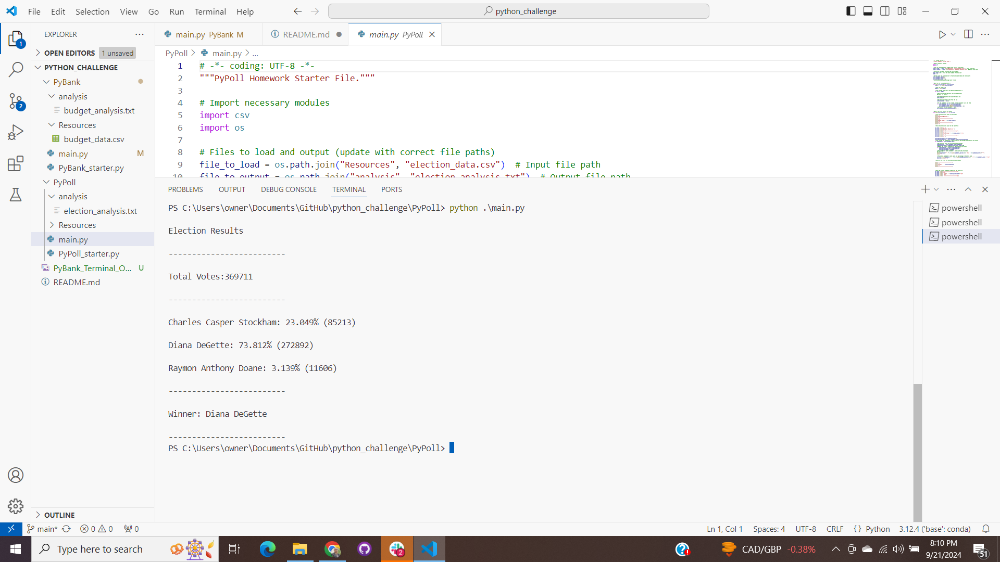

# Python Challenge Repository

Welcome to my **Python Challenge** repository! This project consists of two Python scripting challenges: **PyBank** and **PyPoll**, which tested my ability to analyze data programmatically using Python. These challenges gave me hands-on experience with data manipulation, file I/O, and basic analytics in Python.

## Repository Structure

This repository contains the following key folders and files:

```
python-challenge/
│
├── PyBank/
│   ├── Resources/
│   │   └── budget_data.csv  # CSV file containing financial records for analysis
│   ├── analysis/
│   │   └── budget_analysis.txt  # Output file with financial analysis results
│   └── main.py  # Script for analyzing financial data
│
├── PyPoll/
│   ├── Resources/
│   │   └── election_data.csv  # CSV file containing election data for analysis
│   ├── analysis/
│   │   └── election_results.txt  # Output file with election results
│   └── main.py  # Script for analyzing election data
│
└── README.md  # This file
```

## Challenges Overview

### PyBank
In the **PyBank** challenge, we were tasked with analyzing a company's financial records. The dataset provided in `budget_data.csv` contains two columns:
- **Date**: The month of the record.
- **Profit/Losses**: The net profit or losses for that month.

The Python script has computed the following:
1. Total number of months in the dataset.
2. Net total amount of Profit/Losses.
3. Average change in Profit/Losses over the entire period.
4. The greatest increase in profits (date and amount).
5. The greatest decrease in profits (date and amount).

The final results are displayed in the terminal and exported to a text file in the `analysis` folder.

### PyPoll
In the **PyPoll** challenge, we are given a dataset of election results in `election_data.csv` that includes:
- **Voter ID**: Unique identifier for each voter.
- **County**: The county in which the voter is registered.
- **Candidate**: The candidate the voter chose.

The Python script analyzed this data to provide the following:
1. The total number of votes cast.
2. A list of candidates who received votes.
3. The percentage of votes each candidate won.
4. The total number of votes each candidate won.
5. The winner of the election based on popular vote.

As with PyBank, the results are printed to the terminal and saved to a text file in the `analysis` folder.


### Outputs

**PyBank Example:**

```
Financial Analysis
----------------------------
Total Months: 86
Total: $22564198
Average Change: $-8311.11
Greatest Increase in Profits: Aug-16 ($1862002)
Greatest Decrease in Profits: Feb-14 ($-1825558)
```


**PyPoll Example:**

```
Election Results
-------------------------
Total Votes: 369711
-------------------------
Charles Casper Stockham: 23.049% (85213)
Diana DeGette: 73.812% (272892)
Raymon Anthony Doane: 3.139% (11606)
-------------------------
Winner: Diana DeGette
-------------------------
```
### PyPoll program run Terminal output

